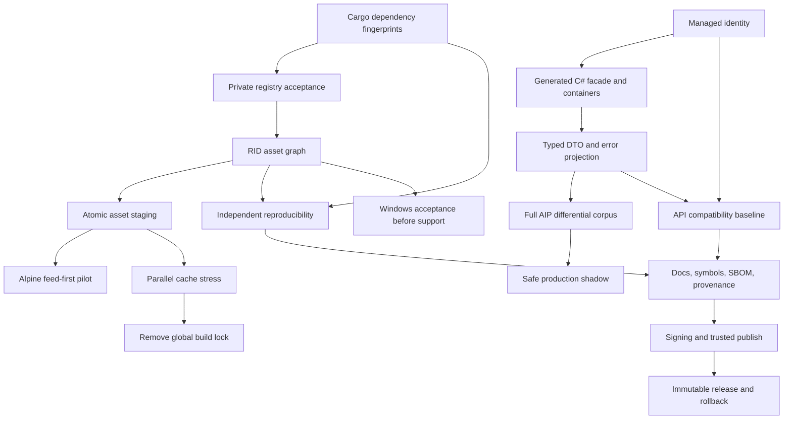

# Release execution plan

This document turns every open item in [`RELEASE_BLOCKERS.md`](RELEASE_BLOCKERS.md) into an
ordered, testable implementation program. It plans the work; it does not redefine a focused proof
as release support.

## Current execution status

Focused-proven in the active working tree:

- R0.1–R0.4 contracts and executable fixtures;
- R1.1's opt-in unique managed namespace/type path, duplicate identity preflight, strict schema,
  single-final-artifact guard, and explicit ilasm requirement (generated facade/direct PE remain);
- R1.3 automatic reachable Cargo input closure, stable no-op, failure invalidation, and receipt hash;
- R1.4 authenticated private-registry/config/credential layering without ambient mutation or token
  leakage;
- R2.3–R2.5 RID-aware SDK restore, typed asset graph, atomic staging/stale cleanup, collision checks,
  preserved runtime/native/resource package paths, and a fresh host-RID C# consumer; and
- R3.1's deterministic synthetic full/blank/short AIP corpus comparing all 82 fields (malformed and
  boundary mutation breadth remains).
- The release host matrix is explicitly Linux/macOS; cargo-dotnet and MSBuild reject Windows hosts
  until Windows build, test, packaging, and MSBuild acceptance exists.

## Definition of complete

The program is complete only when:

1. two independently packaged Rust libraries can be referenced in one ordinary C# project with
   stable, distinct managed identities and typed APIs;
2. Primary Offerings consumes an immutable NuGet package in its real deployment image and can run
   a safe, reversible AIP shadow without returning Rust-owned results;
3. SDK restore semantics, including RID/native/resource assets, are preserved;
4. clean independent builds reproduce package bytes and provenance;
5. supported host/RID matrices are explicit and continuously accepted; and
6. a protected, signed, immutable release can be promoted and rolled back without overwriting a
   version.

## Dependency graph

## Wave 0: freeze contracts and add failing acceptance fixtures

These PRs should contain tests/specifications, not broad implementation.

### R0.1 Managed identity specification — S

- Contract: [`MANAGED_IDENTITY_AND_ABI.md`](MANAGED_IDENTITY_AND_ABI.md).
- Add a versioned `ManagedIdentity` contract: package ID, CLR assembly name, root namespace, module
  type, schema version, and legacy mode.
- Default new packages to a normalized package namespace and unique module type. `MainModule` is
  compatibility-only and requires explicit opt-in.
- Define identifier normalization, collisions, reserved names, and SemVer consequences.
- Anchors: `tools/cargo-dotnet/src/context.rs`, `artifact.rs`, `receipt.rs`, `pack.rs`;
  `cilly/src/ir/asm.rs`; `cilly/src/bin/linker/main.rs`.
- Failing fixture: one C# project references two Rust assemblies exporting the same Rust function
  name; reflection expects two distinct `Namespace.Type` identities.

### R0.2 Managed DTO/error ABI specification — M

- Contract: [`MANAGED_IDENTITY_AND_ABI.md`](MANAGED_IDENTITY_AND_ABI.md).
- Specify exact mappings: `decimal` as `System.Decimal`, `DateOnly` as `System.DateOnly`, enums with
  fixed underlying type, `Option<T>` as `Nullable<T>` for value types, nullable managed references,
  managed UTF-16 strings, and stable error codes.
- Reject unsupported layouts at compile time. Never silently project decimal through `f64`.
- Decide one versioned shape: generated CLR DTOs plus a generated C# facade are preferred over JSON
  or delimited strings.
- Failing fixture covers decimal scale, Unicode, DateOnly, known/unknown enum values, nullable
  present/null, typed errors, and panic containment.
- Anchors: `dotnet_macros/src/lib.rs`, `mycorrhiza/src/nullable.rs`, `system.rs`, `error.rs`,
  `cilly/src/ir/pe_exporter/`.

### R0.3 Full asset graph fixtures — S

- Commit synthetic `project.assets.json` fixtures for `linux-x64`, `linux-musl-x64`, `win-x64`, and
  `osx-arm64`, including `runtimeTargets`, native files, managed runtime files, resources, RID
  fallback, and two intentional collisions.
- Snapshot the expected logical asset graph; no copying implementation in this PR.
- Anchors: `tools/cargo-dotnet/src/nuget_assets.rs` and new fixture directory.

### R0.4 Cargo graph invalidation fixture — S

- Add a nested workspace with two path dependencies, `build.rs`, shared generated input, and a
  private-registry dependency.
- MSBuild acceptance must fail initially when only a transitive source changes.
- Anchors: `msbuild/RustDotnet.targets`, `feasibility/msbuild_acceptance.sh`.

Exit: contracts are reviewed, negative fixtures fail for the intended reasons, and no API shape is
being inferred ad hoc during implementation.

## Wave 1: managed identity and build correctness

R1.1 and R1.3 can run in parallel. Both are P0.

### R1.1 Thread managed identity through the compiler — L

- Replace the fixed `MAIN_MODULE = "MainModule"` ownership assumption with artifact-supplied
  namespace/type identity.
- Thread identity through artifact serialization, linker merge, IL export, PE metadata tables, XML
  member IDs, and receipts.
- Reject two artifacts that define the same managed identity during link/package validation.
- Preserve legacy artifacts only through the explicit legacy flag.
- Tests: IL and PE exporters, artifact roundtrip/mismatch, linker collision, reflection identity,
  and the two-library C# fixture.

### R1.2 Generate the C# facade and container bindings — M

- Generate `Interop.g.cs` with the package namespace/type from the receipt instead of asking users
  to call a global implementation type.
- Parameterize `mycorrhiza` container exports and `msbuild/RustDotnet.Containers.cs`.
- Update `tools/cargo-dotnet/src/xmldoc.rs` to generate the correct member IDs.
- Mark any temporary legacy alias obsolete and prohibit it for new release packages.
- Tests: two packages, container wrappers, XML docs, IntelliSense-visible public API.
- Depends on R1.1.

### R1.3 Automatic Cargo dependency fingerprints — M

- Add a native `cargo dotnet metadata-inputs` helper using `cargo metadata`.
- Emit a deterministic private manifest of workspace/path packages, manifests, lockfile, Rust
  sources, `build.rs`, and declared generated inputs.
- Feed that manifest into MSBuild invalidation and the artifact receipt. Keep
  `RustDotnetInput` only for arbitrary non-Cargo inputs.
- A metadata failure is fatal; it must never degrade to a possibly stale build.
- Tests: edit a transitive path dependency and prove rebuild; immediately repeat and prove no-op.

### R1.4 Private Cargo registry acceptance — S/M

- Status: implemented in the current productization working tree.
- Exercise the existing private Cargo-home layering with an authenticated local sparse registry
  and source replacement configuration.
- Build with an empty private cache; verify the ambient registry/config is not mutated.
- Grep logs, receipts, packages, and uploaded CI artifacts for the throwaway token.
- Add an optional nightly check against a real enterprise registry, but keep presubmit hermetic.
- Depends on R1.3's fixture.

Exit: multiple Rust libraries coexist, Cargo transitive changes cannot be stale, and enterprise
dependency resolution is accepted without leaking secrets.

## Wave 2: typed interop and authoritative NuGet assets

### R2.1 Implement typed DTO projection — L

- Add explicit `#[dotnet_dto]` and `#[dotnet_error]` metadata rather than guessing from arbitrary
  layouts.
- Generate public CLR DTO/enum/error types, constructors/properties, nullability annotations, XML
  docs, and a schema fingerprint.
- Generate Rust-to-managed and managed-to-Rust conversions using the Wave 0 mapping table.
- Reflection/API snapshots are authoritative acceptance evidence.
- The focused release-package gate is `feasibility/api_compat_acceptance.sh`. It reads CLR metadata
  without loading the target assembly, compares a sorted public surface with a committed typed-DTO
  baseline, and proves a deliberate signature break is rejected. It covers binary metadata shape;
  schema fingerprints and semantic compatibility remain separate acceptance responsibilities.
- Depends on R1.1 and R1.2.

### R2.2 Stable result and exception boundary — M

- Project `Result<T,E>` as the specified typed result or managed exception contract.
- Map every panic to a stable safe failure without exposing arbitrary panic payloads in production
  APIs.
- Test every error code, null path, and panic; verify the process remains alive.
- Depends on R2.1.

### R2.3 Parse complete RID asset graphs — M/L

- Replace the current compile/runtime-DLL-only model with typed assets: compile, managed runtime,
  native runtime, resource, content/build where explicitly supported, package owner, RID, and
  logical relative path.
- Select the requested RID target and honor NuGet RID fallback. Preserve relative paths.
- Deterministically sort the graph and reject unsupported/missing RID targets clearly.
- Depends on R0.3.

### R2.4 Atomic staging, collision detection, and stale cleanup — M

- Stage the complete owned asset set in a temporary directory and atomically replace the prior set.
- Maintain an owned manifest so package upgrades/removals delete stale files.
- Reject two owners targeting the same logical path when bytes or assembly identity differ.
- A failed restore/stage leaves the prior valid set untouched.
- Depends on R2.3.

### R2.5 RID-aware NuGet layout and fresh consumers — M

- Emit `lib/<tfm>`, `runtimes/<rid>/lib/<tfm>`, `runtimes/<rid>/native`, and resource paths from the
  authoritative graph. Do not flatten by basename.
- Extend structural validation for RID paths, duplicates, assembly identity, and content types.
- Run actual consumers, including a small native dependency, on every accepted RID.
- Depends on R2.4.

Exit: typed managed APIs work without JSON probes and NuGet runtime behavior matches SDK restore.

## Wave 3: Primary Offerings production-shaped proof

### R3.1 Full AIP 052 differential corpus — M

- Move the existing complete 988-character fixture into a reusable corpus and add blank, short,
  long, wrong record type, invalid date/decimal/enum, boundary, Unicode/non-ASCII, and suffix cases.
- Freeze whether the adapter accepts only ASCII and how it validates UTF-16 before crossing to
  Rust. Compare every field and error category, not serialized probe text.
- Generate deterministic fixture hashes and sanitize all realistic records.
- Lives in the isolated Primary Offerings pilot worktree; C# remains authoritative.
- Depends on R2.1/R2.2.

### R3.2 Safe shadow adapter — M

- Decorate `IAipPositionParser`; always return the C# result.
- Rust execution is feature-flagged, sampled, time-bounded, and kill-switchable.
- Catch every Rust/managed exception. Metrics contain only status/category/latency.
- Correlation uses rotated keyed HMAC; never log raw lines, identifiers, account values, or SSNs.
- Tests prove C# output is unchanged on Rust mismatch, timeout, and exception, and scan logs for
  fixture values.
- Depends on R3.1.

### R3.3 Feed-first Alpine deployment proof — M/L

- Build the immutable Rust NuGet package once, then consume it from a local/staging feed in Primary
  Offerings' actual `dotnet/sdk:8.0-alpine` publish flow. Do not install the Rust compiler in every
  application image.
- Run assembly load, AIP smoke, health endpoint, and native dependency checks on musl/x64.
- If the product cannot support Alpine, fail explicitly and make a Debian-base decision rather than
  quietly changing the claim.
- Depends on R2.5 and R3.2.

### R3.4 Shadow observation and promotion decision — operational

- Establish a reviewable observation window and mismatch/error/latency SLO before allowing Rust to
  own results.
- Rollback remains configuration-only. Valuation/activity parsers are separate later promotions.

Exit: the real repository and deployment shape are pilot-proven; production remains reversible.

## Wave 4: reproducibility and public-package quality

### R4.1 Independent clean reproducibility — M/L

- Build the same pinned source twice from independent clean worktrees/source archives, empty Cargo,
  NuGet, target, and cargo-dotnet homes.
- Compare `.nupkg`, checksum, normalized receipt, generated source, XML docs, PDB policy, and SBOM.
- Fail release mode on a dirty source tree or unpinned toolchain/backend.
- Depends on R1.3 and R2.5.

### R4.2 Docs, symbols, provenance, SBOM, and licenses — M

- Include generated XML docs, chosen symbol/source-link artifact, artifact receipt, source revision,
  deterministic SPDX or CycloneDX SBOM, Cargo/NuGet dependency inventory, and license inventory.
- Verify every packaged hash against the receipt and run NuGet package validation.
- Depends on R4.1.

### R4.3 API compatibility and SemVer — M

- Store a versioned public C# API baseline for generated types/facades.
- Run `Microsoft.DotNet.ApiCompat` or equivalent against the last released package.
- Breaking changes require the configured major-version transition; identity changes are breaking.
- Depends on R1.1 and R2.1; may run alongside R4.2.

### R4.4 Windows support decision and gate — L

- First prove native CLI, private sysroot, file locking, pack, and MSBuild behavior on
  `windows-latest`, including no-op, missing receipt, failed rebuild, and custom-ID consumer.
- Add PowerShell acceptance where shell scripts are not portable.
- If this is deliberately deferred, package/docs/manifest must say Unix build hosts only; do not
  imply general .NET host support.

### R4.5 Parallel cache stress and lock reduction — M

- Run 4–8 concurrent distinct/same-crate builds across profiles/RIDs and repeat them.
- Verify receipt/artifact hashes, private sysroot READY state, generated configs, and asset manifests.
- Replace the global lock with narrow per-key locks only after this matrix is green.
- Depends on R2.4.

Exit: packages are reproducible, inspectable, API-governed, and honest about supported platforms.

## Wave 5: immutable release and rollback

### R5.1 Signing and trusted publishing — M/L

- Add a protected release workflow using pinned action SHAs and an OIDC/trusted-publishing path.
- Sign packages and provenance; verify signatures after download. Secrets never enter logs,
  receipts, caches, or artifacts.
- Release channels reject unsigned packages.
- Depends on R4.2/R4.3.

### R5.2 Immutable version/tag manifest — S/M

- Release only from signed/annotated immutable `v*` tags and a clean checkout.
- Emit a manifest mapping tag to compiler/backend/toolchain, NuGet, receipt, SBOM, and signature
  hashes. Never overwrite a package version.
- Pin `rust-toolchain.toml` and installed SDK components to the release manifest.

### R5.3 Promotion and rollback runbook — S

- Publish to staging, run clean consumers plus the Primary Offerings Alpine smoke, then promote.
- Roll back by selecting the previous immutable package and disabling the shadow; document yanking
  and compromised-key procedures.
- Add negative CI cases for dirty/unpinned/unsigned/changed-after-signing releases.
- Depends on R5.1/R5.2.

Exit: the three outcomes in `PRODUCTIZATION_PLAN.md` may be called `release-supported`.

## Cost-controlled multi-agent execution

Use all four slots only where file ownership does not overlap:

| Role | Model tier | Work |
|---|---|---|
| Orchestrator | Sol | Own contracts, cross-PR sequencing, final integration and claims. |
| Scanner | Luna | Fixture inventory, source-path discovery, matrix enumeration, docs/status updates. |
| Implementer | Terra | One bounded implementation surface plus focused tests. |
| Reviewer | Sol reviewer | ABI, security, stale-artifact, supply-chain, and release go/no-go review. |

Default per PR:

1. Luna inventories exact files/tests and returns evidence only.
2. Orchestrator freezes the contract and assigns one non-overlapping implementation to Terra.
3. Luna runs repetitive matrices and reduces failures to exact logs/reproductions.
4. Sol reviewer audits only high-blast-radius ABI/security/release diffs.
5. Orchestrator runs the authoritative acceptance and updates blocker state.

Do not spend Sol review on formatting, fixture enumeration, log collection, or mechanical platform
ports. Do not let multiple agents edit `dotnet_macros`, PE metadata, `pack.rs`, or MSBuild invalidation
in parallel.

## Suggested delivery schedule

Assuming one primary implementer and parallel cheap fixture/review assistance:

| Milestone | Included waves | Expected elapsed time |
|---|---|---|
| Multi-library and stale-safe developer preview | Wave 0–1 | 2–3 weeks |
| Typed APIs and RID-correct package preview | Wave 2 | 3–5 weeks |
| Contained Primary Offerings production-shaped pilot | Wave 3 | 2–3 weeks |
| Release candidate quality | Wave 4 | 3–5 weeks |
| Signed immutable release | Wave 5 | 1–2 weeks |

Total planning estimate: 11–18 elapsed weeks, with Windows support and typed DTO compiler work as the
largest uncertainty. Each wave is independently useful, but none before Wave 5 satisfies the final
release claim.
